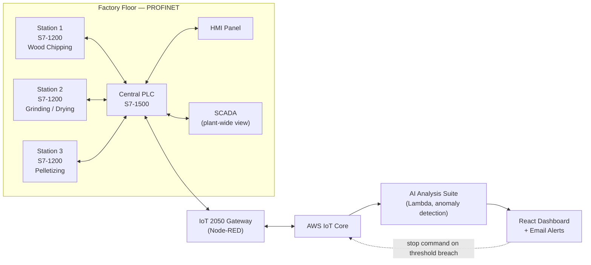

# ByteMe — Industry 4.0 Smart Wood Pellet Factory

Most industrial automation, even at small scale, ends up siloed: each station runs its own PLC, controls its own sensors and motors, and keeps its own data to itself. Nothing's actually broken — but nobody can see the whole line from one place, catch a problem early, or supervise it remotely. This project exists because that same gap shows up in engineering education too: PLCs, sensors, edge computing, and cloud platforms usually get taught as separate topics, so students rarely get the chance to wire them into one real, working system. Built around a physical wood-pellet production line, this is that system — three independently-capable PLC stations, unified under central supervision, extended to a SCADA layer and the cloud, with a safety response that can act back on the hardware. And critically: the machines keep running even if the cloud connection doesn't — the cloud adds visibility and supervision, it was never allowed to become something the factory depends on to function.

## What It Does

- **Reads the process** — three PLC-controlled stations (wood chipping → grinding/drying/conveying → pelletizing) collect moisture, vibration, temperature, pressure, and level data, and scale it from raw counts into real engineering units.
- **Talks station-to-station** — local PLCs report up to a central PLC over PROFINET, which also drives a local HMI panel.
- **Gives operators a plant-wide view** — a SCADA layer sits above the PLC network, showing every station's status from one screen without needing to touch a single local panel.
- **Leaves the building** — an edge gateway running Node-RED reads the central PLC directly and pushes data to AWS IoT Core.
- **Thinks about the data** — a four-engine AI analysis suite scores station health and flags anomalies, with results and alerts surfaced on a live React dashboard.
- **Closes the loop** — if a monitored value crosses a threshold on the cloud side, a stop command travels all the way back down and shuts off the motor automatically. No human required in the middle.
- **Moves, too** — two robot arms round out the physical build, switchable between manual joystick control and a fully automated routine.

## Architecture

The system is layered on purpose: each local PLC keeps full control of its own equipment even if the network or the cloud goes down — the cloud adds supervision and safety response, it doesn't replace local control.

## Results

Every planned deliverable made it into the final build:

| Deliverable | Status |
|---|---|
| Scaled wood-pellet manufacturing model (3 stations) | ✅ Achieved |
| Distributed PLC control (local ↔ central) | ✅ Achieved |
| Motor and actuator control | ✅ Achieved |
| Sensor monitoring (moisture, vibration, temp, pressure, level) | ✅ Achieved |
| HMI / SCADA monitoring | ✅ Achieved |
| Inter-PLC communication | ✅ Achieved |
| Edge/cloud connectivity | ✅ Achieved |
| Remote dashboard + automated alerts | ✅ Achieved |

Cloud-side performance targets were all met too — dashboard updates within seconds, alerts fired within seconds of a threshold breach, and the PLC auto-stop consistently triggered on critical conditions.

## Limitations

- Built to show the *architecture*, not to match full-scale throughput, energy use, or production efficiency.
- Some sensors still need longer-duration calibration before their data is trustworthy for predictive maintenance.
- Cloud monitoring depends on network connectivity — if it drops, local PLC control keeps running, but remote visibility doesn't.
- The AI anomaly detection is a working prototype, not validated against real fault data at scale.
- Basic robot arm movement control.

## Team — ByteMe

| Member | Role |
|---|---|
| Nguyen Quoc Bao | PLC hardware integration, sensor scaling, GET/PUT communication, HMI interface |
| Kim Jong Chul | IoT 2050 integration, Node-RED communication flow |
| Le Minh Thai Hoa | Cloud architecture, 5 Lambda functions, AI anomaly detection, React dashboard |
| Le Tan Loi | Factory mechanical design, robot arm control, button logic |
| Suh Chang Bean | Research, documentation, hardware support |

**Academic Supervisor:** Dr. Thanh Tran — RMIT SSET
